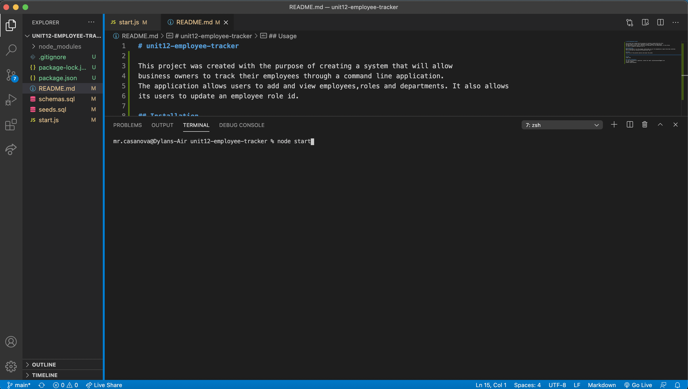
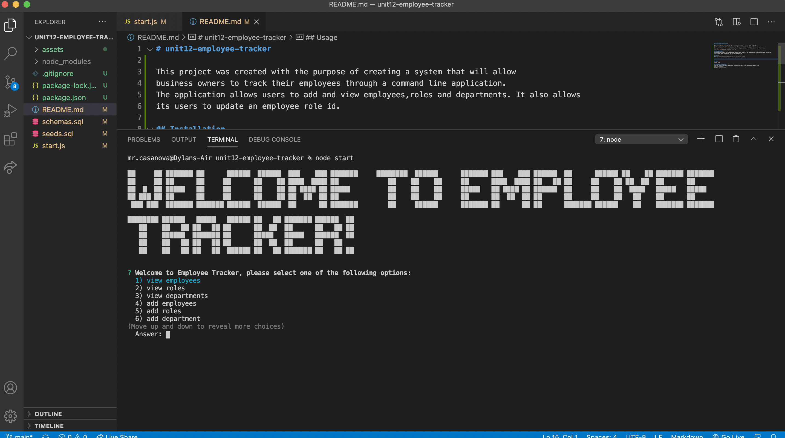
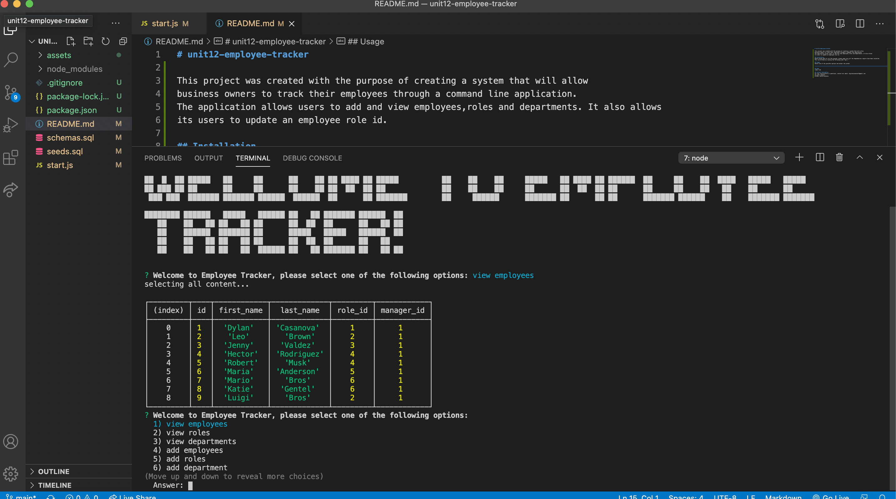
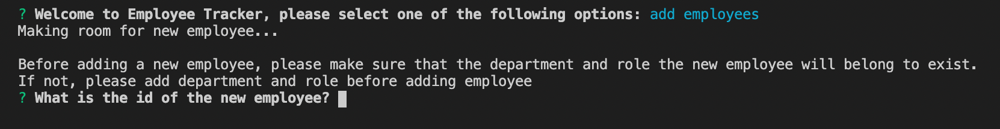
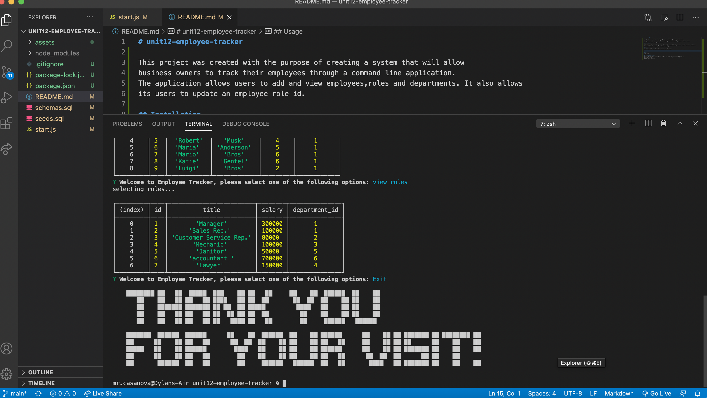

# unit12-employee-tracker

This project was created with the purpose of creating a system that will allow
business owners to track their employees through a command line application.
The application allows users to add and view employees,roles and departments. It also allows
its users to update an employee role id.

## Installation
Before being able to run the program, please make sure all the dependencies require have been installed. 
This can be done by running the following code "npm i "

## Usage
Select one of the possible options and answer the promts.
 
This command starts our application

 

 
menu options

 
view employees option

 
add employee option selected, it promts user for info

 
Exit option selected

## Demo
video link

## contant Information
for any clarification or questions, contact me! email: dyylancasanova17@gmail.com 
for pull request:
GitHub: Dylan-Casanova
